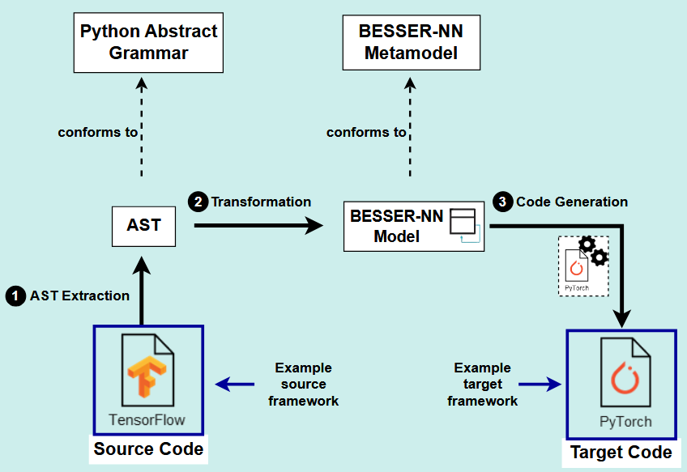

# besser-nn-migration

A tool for migrating neural network code between **TensorFlow** and **PyTorch** using AST and a BUML intermediate representation.



The source file is parsed into an abstract syntax tree. An AST visitor extracts the neural network architecture and (optionally) the training/evaluation configuration into a BUML model. The code generator then renders equivalent code in the target framework.

## Getting started

```bash
git clone https://github.com/besser-pearl/besser-nn-migration.git
cd besser-nn-migration
pip install -r requirements.txt
pip install -e .
```

## Usage

### TensorFlow → PyTorch

```bash
python tf2torch/tf2torch_migrator.py <source_file> <nn_type> <output_name> [--onlynn False] [--datashape <shape>]
```

### PyTorch → TensorFlow

```bash
python torch2tf/torch2tf_migrator.py <source_file> <nn_type> <output_name> [--onlynn False]
```

**Arguments:**
- `source_file`: path to the source `.py` file
- `nn_type`: architecture style: `subclassing` or `sequential`
- `output_name`: base name used for the output file
- `--onlynn False`: also migrate training/evaluation code (default: architecture only)
- `--datashape`: input sample shape, e.g. `"(32,32,3)"` or `"(13)"` It is required for TF→PyTorch when the source uses implicit layer shapes

### Examples

**TF → PyTorch** (tf_tutorial, architecture + training):
```bash
python tf2torch/tf2torch_migrator.py output/tf_tutorial/tf_nn_subclassing.py subclassing tf_tutorial --onlynn False --datashape "(32,32,3)"
```

**PyTorch → TF** (tf_tutorial, architecture + training):
```bash
python torch2tf/torch2tf_migrator.py output/tf_tutorial/pytorch_nn_subclassing.py subclassing tf_tutorial --onlynn False
```

The migrated file is written to `output/migrated_nn/pytorch_nn_tf_tutorial.py` or `output/migrated_nn/tf_nn_tf_tutorial.py` respectively.

Alternatively, use the provided shell scripts as a starting point. Edit the `name`, `datashape`, and `archit_in`/`archit_out` variables to match your model, then run:

```bash
bash migrate_tensorflow_to_pytorch.sh
bash migrate_pytorch_to_tensorflow.sh
```

## Architecture types

Two styles are supported: `subclassing` (class-based, extending `tf.keras.Model` / `nn.Module`) and `sequential` (inline layer stack).

## Notes

**Channel dimensions (TF→PyTorch):** TensorFlow is channels-last (NHWC); PyTorch is channels-first (NCHW). `permute` calls are inserted automatically: `permute(0, 3, 1, 2)` before the first Conv2d and `permute(0, 2, 3, 1)` before Flatten; `permute(0, 2, 1)` before each Conv1d. No permutes are added in the PyTorch→TF direction.

**`--datashape`:** Provide the shape of a single sample without the batch dimension: `(H,W,C)` for images, `(length)` for sequences, `(features)` for tabular data. When required, the tool runs the TF model on a random input to infer intermediate layer shapes.

## Evaluation

Scripts used for the evaluation experiments in the paper are available in:

- `EXP_benchmark_datasets/`: training scripts for each model/dataset combination, in both TF and PyTorch
- `EXP_random_inputs/`: functional equivalence tests comparing migrated models on random inputs, with result figures